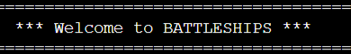
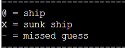
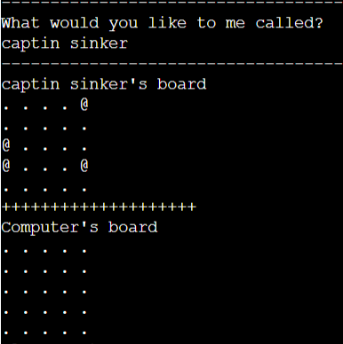
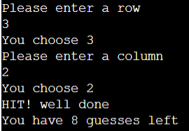

# Battleships The Game 

Battleships is a game where you must destroy all your opponents battleships in order to win the game.
Both you and your opponent have game boards with ships placed on them, you can not see each others board and will have to give coordinates to fire a missle and attempt to sink a battleship. 

- __How to play__

  - You must guess the correct coordinates to hit a ship on the enemies board.
  - You have only 10 guesses and when you run out, the game is over
  - If you hit all the enemies ships you win the game.

- __The Game Area__

  - Once you enter what you would like to be called the game begins.
  - The game shows both yours and the computers board, but the computers board is hidden
  - Each time a new game is started the game generates the game boards and randomly places 4 ships

- __Make a guess__
  - Each turn you will have to guess the row and column.
  - The user will be notified if his missile hit or missed
  - The user will also be notified if the computer hit one of his ships
  - Both game boards update each round
  - How many guesses are left is updated each round

## Features 

- Random board generation
    - Ships are random each game
    - Computers board is hidden to the user
- Input validation
    - Inputs are checked accordingly
- Game board updates each turn
- You can choose the size of the playing board

### Features to Implement in the future

- Add more ships on the board
- Let the user set how many guesses they van have
- Have ships take up more than 1 spot on the board

## Testing

I have manually tested this project by doing:
- Passed in invalid inputs and made sure the program does not crash
- Passed code into PEP8 linter and confirmed no issues
- Tested on local and Code Institute Heroku terminal

## Validator Testing
- PEP8
    - No errors retuned from https://pep8ci.herokuapp.com/

## Deployment

This project was deployed using Code Institute mock terminal for Heroku.
- Steps for deployment:
    - Fork or clone this repository
    - Create a new Heroku app
    - Set buildbacks to Python and NodeJS in that order
    - Link the Heroku app to the repository
    - Click on Deploy

## Credits 
- Code Institute for the deployment terminal
- Wikipedia for details on the battleship game
